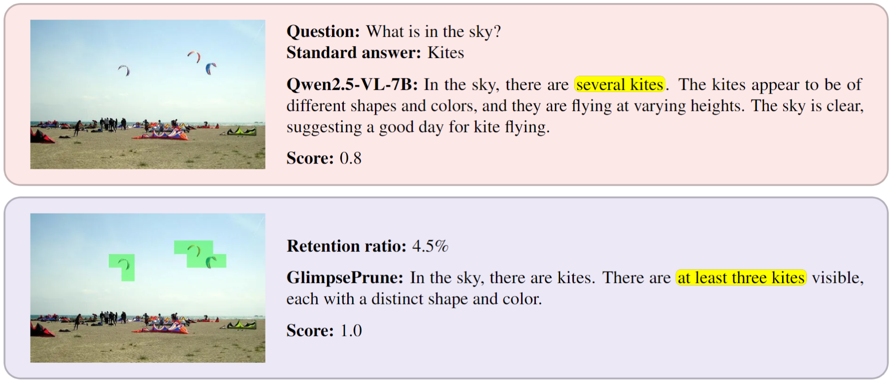
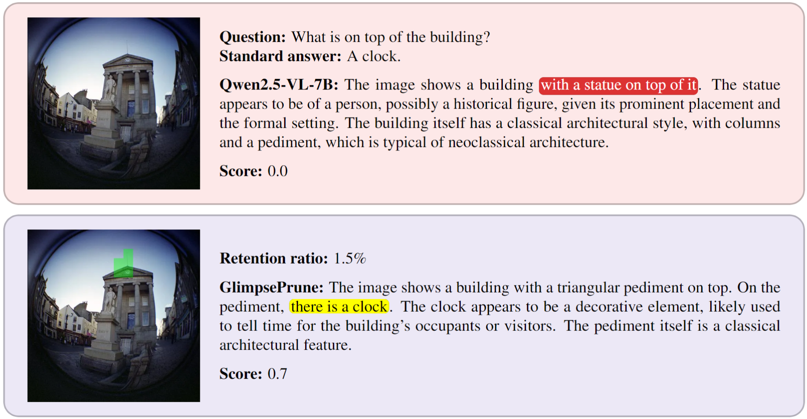
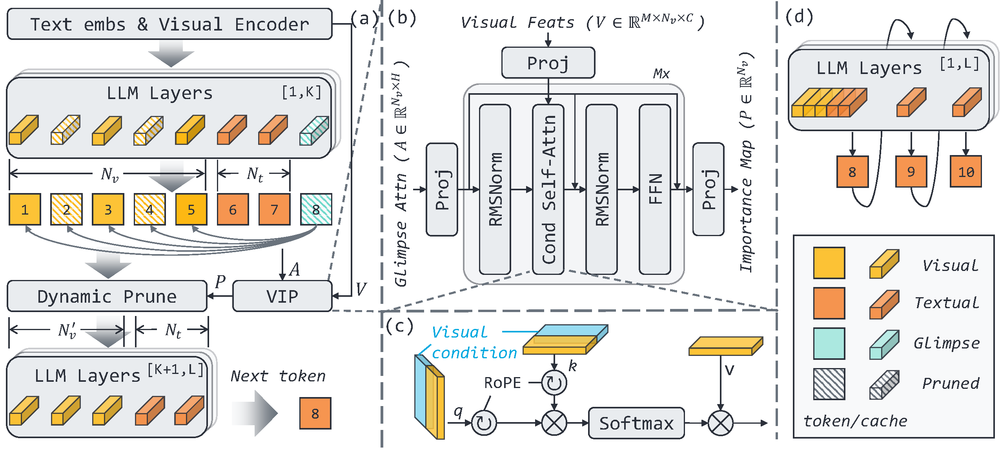
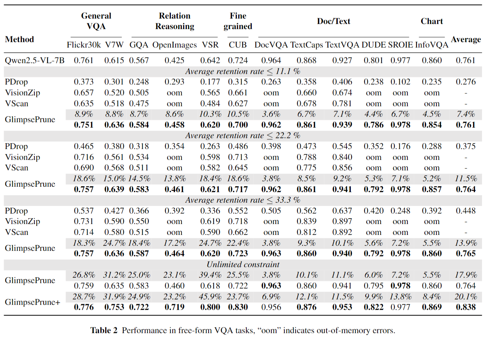

<h1 align="center">GlimpsePrune</h1>
<p align="center">
<a href="README.md">English</a> | <a href="README_zh.md">简体中文</a>
</p>
<p align="center">
<p align="center">
    <strong>A Dynamic Visual Token Pruning Framework for Large Vision-Language Models</strong>
</p>

<p align="center">
    <a href=''></a>
    <a href='https://huggingface.co/collections/ashun989/glimpseprune-688d8826ef5bd09db6af145e'></a>
    <a href="https://github.com/HVision-NKU/GlimpsePrune/blob/main/LICENSE"></a>
</p>

<div align="center">
  
  
  <br>
  <em>GlimpsePrune dynamically prunes a large number of irrelevant visual tokens before answering questions, reducing the model's inference overhead.</em>
</div>

**GlimpsePrune** is a dynamic visual token pruning framework designed for Large Vision-Language Models (LVLMs). Through fast training on a small amount of data (e.g., **less than 1 hour** on 20K GQA data), GlimpsePrune enables Qwen2.5-VL-7B to prune an average of **92.6%** of visual tokens before generating a response, while maintaining performance comparable to the original model.

For more technical details, please refer to our [paper (coming soon)]().

## Table of Contents
- [✨ Key Features](#-key-features)
- [🚀 News](#-news)
- [🖼️ Framework Overview](#️-framework-overview)
- [📊 Performance Results](#-performance-results)
- [✅ Roadmap](#-roadmap)
- [🛠️ Installation](#️-installation)
- [📦 Models and Data](#-models-and-data)
- [▶️ How to Use](#️-how-to-use)
  - [Local Demo](#local-demo)
  - [Inference](#inference)
  - [Evaluation](#evaluation)
  - [Training](#training)
- [🙏 Acknowledgements](#-acknowledgements)
- [🖊️ Citation](#️-citation)
- [📧 Contact Us](#-contact-us)

## ✨ Key Features

- **High Pruning Rate**: Prunes over **90%** of visual tokens on average with almost no performance loss, effectively reducing computational and memory overhead.
- **Robust Performance**: Stable performance when processing high-resolution images and handling complex **free-form VQA** tasks.
- **Lightweight Training**: Only a few extra parameters (Glimpse token and VIP) need to be trained, completed in less than 1 hour on a single A100 GPU.
- **Broad Compatibility**: Supports single and multi-image inputs, is compatible with KV-Cache and Flash Attention 2, and provides a fair comparison benchmark with other mainstream visual compression methods.

## 🚀 News

- **`2025.08.03`**: [Code](https://github.com/HVision-NKU/GlimpsePrune) and [Models](https://huggingface.co/collections/ashun989/glimpseprune-688d8826ef5bd09db6af145e) are publicly released!

## 🖼️ Framework Overview

The core idea of GlimpsePrune is to introduce a lightweight "Glimpse Module" that can quickly identify and retain the visual regions most relevant to the text prompt, pruning the remaining redundant information.

<div align="center">
  
</div>

The core code implementation is located in:
- **Qwen2.5-VL**: [`transformers_gp/models/qwen2_5_vl/model_gp.py`](transformers_gp/models/qwen2_5_vl/model_gp.py)
- **LLaVA-1.5**: [`llava_gp/model/language_model/llava_llama.py`](llava_gp/model/language_model/llava_llama.py)

## 📊 Performance Results

We evaluated GlimpsePrune on multiple VQA benchmarks. The results show that it achieves a high pruning rate while maintaining performance on par with the original model, outperforming other visual compression methods.

<p align="center">
  <b>Free-form VQA Benchmarks</b><br>
  
</p>

<p align="center">
  <b>Short-form VQA Benchmarks</b><br>
  
</p>

## ✅ Roadmap

- [x] Support for [Qwen2.5-VL](https://github.com/QwenLM/Qwen2.5-VL)
- [x] Support for single-image input
- [x] Support for multi-image input
- [x] Provide a local Gradio Demo
- [x] Support for [LLaVA-1.5](https://github.com/haotian-liu/LLaVA)
- [x] Provide evaluation [scripts](scripts) for various visual token compression methods ([PyramidDrop](https://github.com/Cooperx521/PyramidDrop), [VisionZip](https://github.com/dvlab-research/VisionZip), etc.) on the free-form VQA
- [ ] Support for batch input (Batch Inference)
- [ ] Support for video input
- [ ] Support for [LLaVA-NeXt](https://github.com/LLaVA-VL/LLaVA-NeXT)
- [ ] Provide an online Demo

## 🛠️ Installation

1.  **Clone the repository**
    ```bash
    git clone https://github.com/HVision-NKU/GlimpsePrune.git
    cd GlimpsePrune
    ```

2.  **Create an environment and install dependencies**
    We recommend create seperated virtual environment for different models:
    
    **For Qwen2.5-VL:**
    - `python=3.10`
    - [`torch==2.7.0`](https://pytorch.org/get-started/previous-versions/)
    - [`flash-attn==2.7.4.post1`](https://github.com/Dao-AILab/flash-attention/releases/tag/v2.7.4.post1)
    - `pip install -r qwen_requirements.txt`
    - `pip install qwen-vl-utils[decord]`
    
    **For LLaVA-1.5 (Optional):**
    <details>
    <summary>Click to expand LLaVA dependency installation</summary>

    - `python=3.10`
    - [`torch==2.1.2`](https://pytorch.org/get-started/previous-versions/)
    - [`flash-attn=2.7.3`](https://github.com/Dao-AILab/flash-attention/releases/tag/v2.7.3)
    - `pip install -r llava_requirements.txt`
    </details>
   
    **Additional dependencies for Evaluation and Demo (Optional):**
    ```bash
    # Evaluation
    pip install lmms-eval==0.3.5 vllm==0.9.0.1
    # Demo
    pip install gradio==5.39.0
    ```
   
## 📦 Models and Data

### Model Download
All models can be automatically downloaded from the Hugging Face Hub. If you encounter network issues, you can download them manually to a local directory. `<new_module>` are the weights of the extra glimpse token and VIP modules we trained.

|`<base_model>`| `<new_module>` |
|:---:|:---:|
|[Qwen/Qwen2.5-VL-3B-Instruct](https://huggingface.co/Qwen/Qwen2.5-VL-3B-Instruct)|[ashun989/GlimpsePrune_Qwen2.5-VL-3B-Instruct](https://huggingface.co/ashun989/GlimpsePrune_Qwen2.5-VL-3B-Instruct)|
|[Qwen/Qwen2.5-VL-7B-Instruct](https://huggingface.co/Qwen/Qwen2.5-VL-3B-Instruct)|[ashun989/GlimpsePrune_Qwen2.5-VL-7B-Instruct](https://huggingface.co/ashun989/GlimpsePrune_Qwen2.5-VL-3B-Instruct)|
|[liuhaotian/llava-v1.5-7b](https://huggingface.co/liuhaotian/llava-v1.5-7b)|[ashun989/GlimpsePrune_LLaVA-1.5-7B](https://huggingface.co/ashun989/GlimpsePrune_LLaVA-1.5-7B)|
|[liuhaotian/llava-v1.5-13b](https://huggingface.co/liuhaotian/llava-v1.5-13b)|[ashun989/GlimpsePrune_LLaVA-1.5-13B](https://huggingface.co/ashun989/GlimpsePrune_LLaVA-1.5-13B)|

### Data Preparation
Training and Free-form VQA evaluation use the [Visual-CoT](https://huggingface.co/datasets/deepcs233/Visual-CoT/tree/main) dataset.

```bash
# Download the dataset (approx. 128GB)
huggingface-cli download --repo-type dataset --local-dir datas deepcs233/Visual-CoT cot_images_tar_split

# Extract
cd datas/cot_images_tar_split
cat cot_images_* | tar -xvf - -C ../cot
cd ../.. # Return to the project root directory
```
After extraction, the `datas` directory structure should be as follows:
```
GlimpsePrune/
├── datas/
│   └── cot/
│       ├── cub/
│       ├── gqa/
│       └── ...
└── ...
```

## ▶️ How to Use

### Local Demo
We provide a Gradio Demo to intuitively experience the effects of GlimpsePrune.

```bash
python demo_gp.py \
    --base_model Qwen/Qwen2.5-VL-7B-Instruct \
    --new_modules_dir ashun989/GlimpsePrune_Qwen2.5-VL-7B-Instruct
```

### Inference
For a detailed example of how to load the model and perform inference, please refer to the Jupyter Notebook:
➡️ [**`notebook/gp_tutorial.ipynb`**](notebook/gp_tutorial.ipynb)

### Evaluation
We provide convenient evaluation scripts.

#### Free-form VQA
```bash
# Default settings (no retention rate limit)
BASE_MODEL=<base_model> bash infer_qwen_gp_cot.sh <new_modules_dir>

# Set a maximum retention rate (e.g., 11.1%)
BASE_MODEL=<base_model> MAX_REMAIN_RATIO=0.111 bash infer_qwen_gp_cot.sh <new_modules_dir>
```

#### Short-form VQA
```bash
# Default settings
BASE_MODEL=<base_model> bash eval_qwen_gp.sh <new_modules_dir>

# Set a maximum retention rate
BASE_MODEL=<base_model> MAX_REMAIN_RATIO=0.111 bash eval_qwen_gp.sh <new_modules_dir>
```

### Training

#### Train GlimpsePrune
Training on Qwen2.5-VL-3B-Instruct requires at least two 24GB GPUs (e.g., RTX 3090) and takes about 1 hour.
```bash
# Train Qwen2.5-VL
CUDA_VISIBLE_DEVICES=0,1 \
bash scripts/train_qwen_gp.sh

# Train LLaVA-1.5
CUDA_VISIBLE_DEVICES=0,1 \
bash scripts/train_llava_gp.sh
```

#### Train GlimpsePrune+ (Optional)
Training on Qwen2.5-VL-7B-Instruct requires four 80GB A100 GPUs, plus an additional 48GB of VRAM to run the reward model, and takes about 24 hours.
```bash
# 1. Deploy the reward model
bash scripts/vllm_serve.sh
# 2. Test the API
python test_api.py
# 3. Start training
CUDA_VISIBLE_DEVICES=0,1,2,3 \
bash scripts/train_qwen_gp_plus.sh
```

## 🙏 Acknowledgements

This project is based on the following excellent open-source work, and we express our sincere gratitude:
- [Qwen2.5-VL](https://github.com/QwenLM/Qwen2.5-VL) / [LLaVA](https://github.com/haotian-liu/LLaVA): Powerful Large Vision-Language Models.
- [Visual-CoT](https://github.com/deepcs233/Visual-CoT): A VQA dataset with rich domains, diverse object sizes, and bounding box annotations.
- [PyramidDrop](https://github.com/Cooperx521/PyramidDrop), [VisionZip](https://github.com/dvlab-research/VisionZip), [DivPrune](https://github.com/vbdi/divprune), [CDPruner](https://github.com/Theia-4869/CDPruner), [VScan](https://github.com/Tencent/SelfEvolvingAgent/tree/main/VScan): Other exploratory works in the field of visual token compression.

## 🖊️ Citation

If you find our work helpful, please consider citing our paper:
```bibtex
TBD
```

## 📧 Contact Us

For any technical questions or academic collaborations, feel free to contact us via email: `qszeng[AT]mail.nankai.edu.cn`