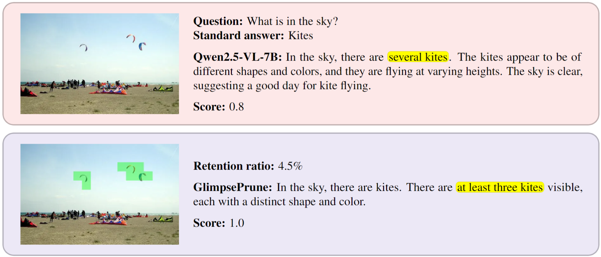
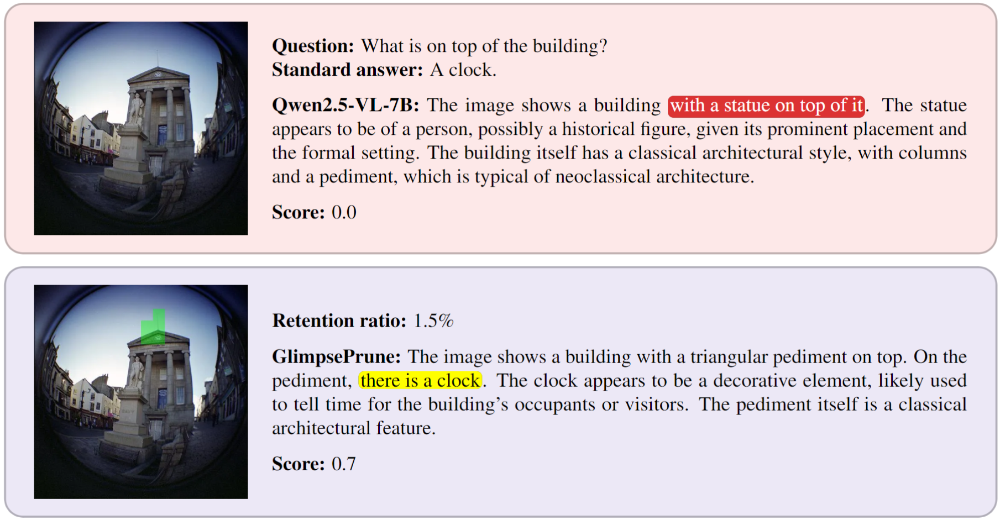
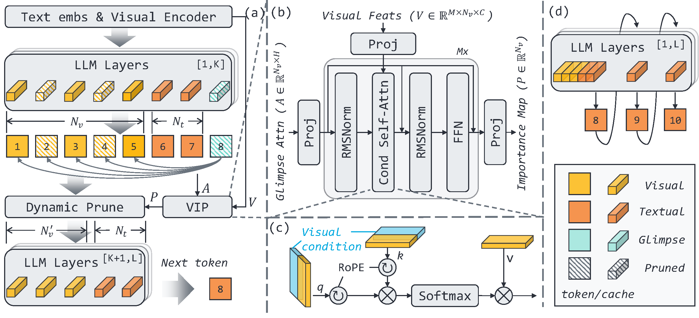
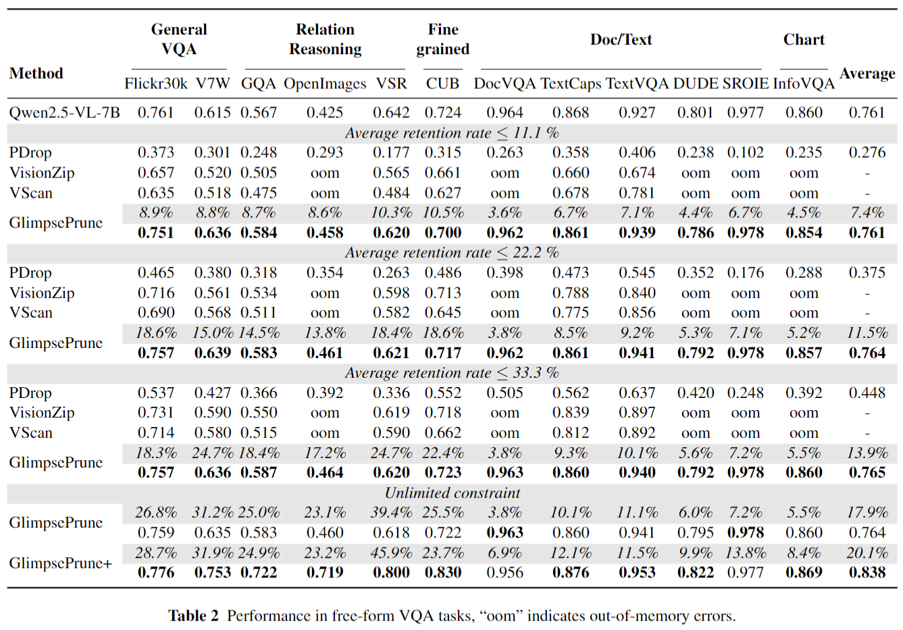
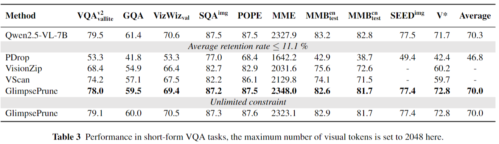

<h1 align="center">GlimpsePrune</h1>
<p align="center">
<a href="README.md">English</a> | <a href="README_zh.md">简体中文</a>
</p>
<p align="center">
<p align="center">
    <strong>面向大型视觉语言模型的动态视觉Token剪枝框架</strong>
</p>

<p align="center">
    <a href=''></a>
    <a href='https://huggingface.co/collections/ashun989/glimpseprune-688d8826ef5bd09db6af145e'></a>
    <a href="https://github.com/HVision-NKU/GlimpsePrune/blob/main/LICENSE"></a>
</p>

<div align="center">
  
  
  <br>
  <em>GlimpsePrune 在回答问题前动态剪除大量无关的视觉Token，以降低模型推理开销。</em>
</div>

**GlimpsePrune** 是一个为大型视觉语言模型 (LVLMs) 设计的动态视觉Token剪枝框架。通过在少量数据上进行快速训练（例如，在20K GQA数据上训练**少于1小时**），GlimpsePrune 能够让 Qwen2.5-VL-7B 在生成回答前，平均剪除 **92.6%** 的视觉Token，同时保持与原始模型相当的性能。

更多技术细节，请参阅我们的[论文 (即将发布)]()。

## 目录
- [✨ 主要特性](#-主要特性)
- [🚀 最新动态](#-最新动态)
- [🖼️ 框架概览](#️-框架概览)
- [📊 性能结果](#-性能结果)
- [✅ 功能路线图](#-功能路线图)
- [🛠️ 安装指南](#️-安装指南)
- [📦 模型与数据](#-模型与数据)
- [▶️ 如何使用](#️-如何使用)
  - [本地 Demo](#本地-demo)
  - [推理](#推理)
  - [评估](#评估)
  - [训练](#训练)
- [🙏 致谢](#-致谢)
- [🖊️ 引用](#️-引用)
- [📧 联系我们](#-联系我们)

## ✨ 主要特性

- **高剪枝率**：在几乎不损失性能的情况下，平均剪除超过 **90%** 的视觉Token，有效降低计算和显存开销。
- **性能鲁棒**：在处理高分辨率图像及应对复杂的**自由格式问答（Free-form VQA）**任务时表现稳定。
- **训练轻量**：仅需训练少量额外参数（Glimpse token 和 VIP），在单张 A100 上不到1小时即可完成。
- **广泛兼容**：支持单图、多图输入， 兼容KV-Cache与Flash Attention2，并提供了与其他主流视觉压缩方法的公平比较基准。

## 🚀 最新动态

- **`2025.08.03`**: [代码](https://github.com/HVision-NKU/GlimpsePrune) 和 [模型](https://huggingface.co/collections/ashun989/glimpseprune-688d8826ef5bd09db6af145e) 已公开发布！

## 🖼️ 框架概览

GlimpsePrune 的核心思想是引入一个**glimpse token**和一个轻量级的**Visual tokens Important Predictor (VIP)**，它能根据文本提示快速识别并保留与问题最相关的视觉区域，剪除其余冗余信息。

<div align="center">
  
</div>

核心代码实现位于:
- **Qwen2.5-VL**: [`transformers_gp/models/qwen2_5_vl/model_gp.py`](transformers_gp/models/qwen2_5_vl/model_gp.py)
- **LLaVA-1.5**: [`llava_gp/model/language_model/llava_llama.py`](llava_gp/model/language_model/llava_llama.py)

## 📊 性能结果

我们在多个 VQA 基准上评估了 GlimpsePrune。结果表明，其在实现高剪枝率的同时，性能与原始模型持平，并优于其他视觉压缩方法。

<p align="center">
  <b>Free-form VQA Benchmarks</b><br>
  
</p>

<p align="center">
  <b>Short-form VQA Benchmarks</b><br>
  
</p>

## ✅ 功能路线图

- [x] 支持 [Qwen2.5-VL](https://github.com/QwenLM/Qwen2.5-VL)
- [x] 支持单张图像输入
- [x] 支持多张图像输入
- [x] 提供本地 Gradio Demo
- [x] 支持 [LLaVA-1.5](https://github.com/haotian-liu/LLaVA)
- [x] 提供多种视觉Token压缩方法在free-form VQA任务上的[评估脚本](scripts) ([PyramidDrop](https://github.com/Cooperx521/PyramidDrop), [VisionZip](https://github.com/dvlab-research/VisionZip), etc.)
- [ ] 支持批量输入 (Batch Inference)
- [ ] 支持视频输入
- [ ] 支持 [LLaVA-NeXt](https://github.com/LLaVA-VL/LLaVA-NeXT)
- [ ] 提供在线 Demo

## 🛠️ 安装指南

1. **克隆仓库**
   ```bash
   git clone https://github.com/HVision-NKU/GlimpsePrune.git
   cd GlimpsePrune
   ```

2. **创建环境并安装依赖**
   我们建议为不同的模型创建分离的环境：

   **对于 Qwen2.5-VL:**

   - `python=3.10`
   - [`torch==2.7.0`](https://pytorch.org/get-started/previous-versions/)
   - [`flash-attn==2.7.4.post1`](https://github.com/Dao-AILab/flash-attention/releases/tag/v2.7.4.post1)
   - `pip install -r qwen_requirements.txt`
   - `pip install qwen-vl-utils[decord]`
   
   **对于 LLaVA-1.5 (可选):**
   <details>
   <summary>点击展开 LLaVA 依赖安装</summary>
   
   - `python=3.10`
   - [`torch==2.1.2`](https://pytorch.org/get-started/previous-versions/)
   - [`flash-attn=2.7.3`](https://github.com/Dao-AILab/flash-attention/releases/tag/v2.7.3)
   - `pip install -r llava_requirements.txt`
   </details>
   
   **评估和 Demo 的额外依赖 (可选):**
   ```bash
   # 评估
   pip install lmms-eval==0.3.5 vllm==0.9.0.1
   # Demo
   pip install gradio==5.39.0
   ```
   
## 📦 模型与数据

### 模型下载
所有模型均可通过 Hugging Face Hub 自动下载。如果遇到网络问题，可以手动下载到本地。`<new_module>` 是我们训练的额外glimpse token 和 VIP 模块的权重。

|`<base_model>`| `<new_module>` |
|:---:|:---:|
|[Qwen/Qwen2.5-VL-3B-Instruct](https://huggingface.co/Qwen/Qwen2.5-VL-3B-Instruct)|[ashun989/GlimpsePrune_Qwen2.5-VL-3B-Instruct](https://huggingface.co/ashun989/GlimpsePrune_Qwen2.5-VL-3B-Instruct)|
|[Qwen/Qwen2.5-VL-7B-Instruct](https://huggingface.co/Qwen/Qwen2.5-VL-3B-Instruct)|[ashun989/GlimpsePrune_Qwen2.5-VL-7B-Instruct](https://huggingface.co/ashun989/GlimpsePrune_Qwen2.5-VL-3B-Instruct)|
|[liuhaotian/llava-v1.5-7b](https://huggingface.co/liuhaotian/llava-v1.5-7b)|[ashun989/GlimpsePrune_LLaVA-1.5-7B](https://huggingface.co/ashun989/GlimpsePrune_LLaVA-1.5-7B)|
|[liuhaotian/llava-v1.5-13b](https://huggingface.co/liuhaotian/llava-v1.5-13b)|[ashun989/GlimpsePrune_LLaVA-1.5-13B](https://huggingface.co/ashun989/GlimpsePrune_LLaVA-1.5-13B)|


### 数据准备
训练和 Free-form VQA 评估使用了 [Visual-CoT](https://huggingface.co/datasets/deepcs233/Visual-CoT/tree/main) 数据集。

```bash
# 下载数据集 (约 128GB)
huggingface-cli download --repo-type dataset --local-dir datas deepcs233/Visual-CoT cot_images_tar_split

# 解压
cd datas/cot_images_tar_split
cat cot_images_* | tar -xvf - -C ../cot
cd ../.. # 返回项目根目录
```
解压后，`datas` 目录结构应如下所示：
```
GlimpsePrune/
├── datas/
│   └── cot/
│       ├── cub/
│       ├── gqa/
│       └── ...
└── ...
```

## ▶️ 如何使用

### 本地 Demo
我们提供了一个 Gradio Demo 来直观体验 GlimpsePrune 的效果。

```bash
python demo_gp.py \
    --base_model Qwen/Qwen2.5-VL-7B-Instruct \
    --new_modules_dir ashun989/GlimpsePrune_Qwen2.5-VL-7B-Instruct
```

### 推理
关于如何加载模型并进行推理的详细示例，请参考Jupyter Notebook:
➡️ [**`notebook/gp_tutorial.ipynb`**](notebook/gp_tutorial.ipynb)

### 评估
我们提供了便捷的评估脚本。

#### Free-form VQA (长文本问答)
```bash
# 默认设置 (无保留率限制)
BASE_MODEL=<base_model> bash infer_qwen_gp_cot.sh <new_modules_dir>

# 设置最大保留率 (例如 11.1%)
BASE_MODEL=<base_model> MAX_REMAIN_RATIO=0.111 bash infer_qwen_gp_cot.sh <new_modules_dir>
```

#### Short-form VQA (短文本问答)
```bash
# 默认设置
BASE_MODEL=<base_model> bash eval_qwen_gp.sh <new_modules_dir>

# 设置最大保留率
BASE_MODEL=<base_model> MAX_REMAIN_RATIO=0.111 bash eval_qwen_gp.sh <new_modules_dir>
```

### 训练

#### 训练 GlimpsePrune
在 Qwen2.5-VL-3B-Instruct 上训练，需要至少2张 24G 显存的 GPU（如 RTX 3090），耗时约1小时。
```bash
# 训练 Qwen2.5-VL
CUDA_VISIBLE_DEVICES=0,1 \
bash scripts/train_qwen_gp.sh

# 训练 LLaVA-1.5
CUDA_VISIBLE_DEVICES=0,1 \
bash scripts/train_llava_gp.sh
```

#### 训练 GlimpsePrune+ (可选)
在 Qwen2.5-VL-7B-Instruct 上训练，需要4张 80G A100，并额外需要48G显存运行奖励模型，耗时约24小时。
```bash
# 1. 部署奖励模型
bash scripts/vllm_serve.sh
# 2. 测试API
python test_api.py
# 3. 开始训练
CUDA_VISIBLE_DEVICES=0,1,2,3 \
bash scripts/train_qwen_gp_plus.sh
```

## 🙏 致谢

本项目基于以下优秀的开源工作，在此表示诚挚的感谢：
- [Qwen2.5-VL](https://github.com/QwenLM/Qwen2.5-VL) / [LLaVA](https://github.com/haotian-liu/LLaVA): 强大的大型视觉语言模型。
- [Visual-CoT](https://github.com/deepcs233/Visual-CoT): 领域丰富、目标尺寸丰富、有box标注的 VQA 数据集。
- [PyramidDrop](https://github.com/Cooperx521/PyramidDrop), [VisionZip](https://github.com/dvlab-research/VisionZip), [DivPrune](https://github.com/vbdi/divprune), [CDPruner](https://github.com/Theia-4869/CDPruner), [VScan](https://github.com/Tencent/SelfEvolvingAgent/tree/main/VScan): 其他视觉Token压缩领域的探索工作。

## 🖊️ 引用

如果我们的工作对您有所帮助，请考虑引用我们的论文：
```bibtex
TBD
```

## 📧 联系我们

如有任何技术问题或学术合作，欢迎通过邮件联系我们： `qszeng[AT]mail.nankai.edu.cn`

